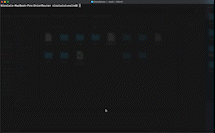
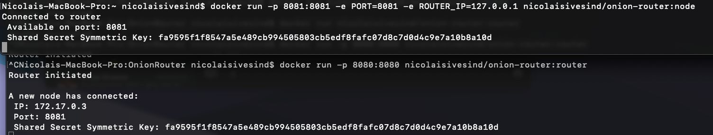

# IDATT2104 Onion Router
## Om prosjektet
Dette er et prosjekt i emnet "IDATT2104 - Nettverksprogrammering" ved NTNU, vår 2022. Vi fikk i oppgave å lage vår egen
implementasjon av konseptet *Onion Routing*. Vi kan selv velge hva slags funksjonalitet løsningen vår skal ha, gitt at
vi ikke tar i bruk bibliotek for Onion Routing.
#### Gruppemedlemmer:
    - Nicolai Thorer Sivesind
    - Erlend Rønning

#### Repository:
https://github.com/Brilleslangen/OnionRouter

#### Lenke til siste CI/CD
https://github.com/Brilleslangen/OnionRouter/actions/runs/2048139237

#### Lenke til Docker-images
https://hub.docker.com/r/nicolaisivesind/onion-router/tags

## Vår løsning
### Frontend funksjonalitet
Vi har laget en web-tjener som lar brukeren hente inn en vilkårlig nettside via HTTP.<br><br>
 <br><br>
Den gjør kun en enkelt GET-forespørsel til linken som blir gitt i tekstboksen. Løsningen vil så vise en kopi av
responsen den fikk fra GET-forespørselen. 

### Backend funksjonalitet
Løsningen vår består i hovedsak av to ulike type tjenere og en datastruktur som den kommuniserer mellom nodene med.

**Router** <br>
Dette er selve web-tjeneren som kjøres på brukerens maskin. Hovedoppgaven dens er å ta imot og utføre forespørslene som 
brukeren ønsker å utføre helt anonymt. Den gjør dette ved å sende forespørselen gjennom tre tilfeldige noder og ved å kryptere
innholdet i flere lag (ett lag per node). Vi kommer tilbake til hvordan den gjør dette under *Tjenesten i praksis*.

**Node** <br>
Dette er en tjener som brukes til å videresende forespørsler og responser til andre noder eller utføre 
http-forespørselen som brukeren sendte inn. Hver node starter opp ved å koble seg til web-tjeneren og opprette en 
*Shared secret* symmetrisk nøkkel til kryptering og dekryptering. Vi forklarer mer om dette under *Krypteringsløsning*

**Payload** <br>
Dette er en struktur som sendes med en POST-forespørsel mellom webserveren og en nodene, og nodene seg i mellom.
Datastrukturen består av to felt:<br>
* <ins>NextNode</ins> <br> Dette er en streng som holder adressen til neste node<br>
* <ins>Content</ins> <br>
Dette er en byte-array som holder det krypterte innholdet som sendes mellom nodene.

Med unntak av siste node så holder Content-feltet en JSON-formatert og kryptert versjon av Payload-strukturen som 
sendes til neste node. For siste node er NextNode-feltet tomt - det signaliserer til noden at det nå er en link i 
Content-feltet som den skal sende en GET-forespørsel til og deretter returnere en kryptert versjon av i responsen.

### Starte opp tjenesten og danne et node-nettverk
For at tjenesten skal fungere må vi først ha en web-tjener (router) som kjører. Deretter må <ins>MINST</ins> tre noder koblet 
seg til web-tjeneren. Hver node oppretter hver sin symmetrisk nøkkel med web-tjeneren.

1. Start opp server
2. Start opp minst tre ulike noder<br>
   (Hvis nodene kjøres på samme maskin må de ha ulike porter.)

### Tjenesten i praksis
Her forklarer vi hva som skjer når en bruker sender inn en lenke den ønsker å anonymt hente inn i nettleseren.

1. Brukeren sender inn en lenke via en POST-forespørsel til routeren (web-tjeneren)
2. Routeren velger ut tre tilfeldige noder (av de tilgjengelige som har koblet seg til) 
3. Routeren pakker så denne lenken og nodene den skal sendes gjennom i flere lag:
   1. Routeren oppretter en Payload-instans og setter lenken inn i Content-feltet og lar NextNode-feltet være tomt.
   2. Den JSON-formaterer så denne Payload-instansen og krypterer dette igjen med node#3 (siste) sin symmetriske nøkkel.
   3. Den oppretter så en ny Payload-instans, putter byte-arrayen fra steg 2 inn i Content-feltet og setter NextNode
   feltet til å være Node#3 sin adresse. 
   4. Steg ii. og iii. gjentas to ganger til, bare med Node#2 og Node#1 sine nøkler og adresser.
4. Routeren sender så det trippelkrypterte payload-instansen til Node#1 i en POST-forespørsel
5. Node#1 dekrypterer innholdet fra forespørselen den mottar med sin symmetriske nøkkel og parser resultatet fra 
JSON-byte-array til en ny payload-instans. Denne payload-instansen holder adressen til neste node samt den krypterte 
pakken den skal sende.
6. Node#2 utførerer samme prosess som Node#1 i steg 5.
7. Node#3 utfører også samme prosess som Node#1 og #2, men nå er NextNode-feltet tomt. Da vet den at den nå skal 
utføre en GET-forespørsel og foretar derfor en GET-forespørsel til url-en i Content-feltet i Payload-instansen.
8. Node#3 leser inn hele responsen på GET-forespørselen til en byte-array. Deretter krypteres hele byte-arrayen
med Node#3 sin symmetriske nøkkel, før den sender denne krypterte byte-arrayen tilbake som respons til Node#2.
9. Node#2 og #1 gjentar prosessen i steg 8, bare med sine egne symmetriske nøkler.
10. Routeren mottar så responsen fra Node#1, dekrypterer responsen tre ganger - med node#3 sin nøkkel, deretter med Node#2 
sin nøkkel og så til slutt med Node#3 sin nøkkel.
11. Responsen er nå helt dekryptert og routeren skriver responsen til nettleseren til brukeren.

### Krypteringsløsning
### Fremtidig arbeid
* **Implementere interaktivitet** <br>
Siden vi kun viser fram en kopi av responsen, så er ikke nettsiden noe mer interaktiv enn det som følger med i reposnen
fra GET-forespørselens om gjøres. Det er likevel mulig å trykke på lenker, eller for responsen til å redirigere 
nettleseren til en ny side. Dette er betydelige svakheter - Hvis brukeren sendes til en ekstern lenke, så er det ikke
gjennom nodene, men gjennom nettleserend den er inni.
<br>
* **Implementere HTTPS** <br>
Vi bruker kun vanlig HTTP, dette betyr at forespørselene kan hijackes av ondsinnede aktører på f.eks samme Wifi.
I motsetning til HTTP så oppretter HTTPS en TLS-kobling og sender over krypterte-forespørslene. Innholdet i 
forespørslene vår er allerede kryptert i løsningen vår, men å oppgradere til HTTPS vil gi oss enda et lag med sikkerhet.
<br>
* **Omgjøre tjenesten til en proxy**<br>
Vi ønsker å videreutvikle løsningen slik at det er en proxy som kan konfigureres på en maskin istedenfor at man må bruke
denne web-serveren som klient. Dette vil også løse problemet med Interaktivtet.

**Oppsummering av svakhetene**
1. Tjenestem beskytter ikke mot omdirigeringer som gjør det lett for sider å få direkte kontakt med brukeren.
2. Den kan kun sende en enkelt GET-forespørsel og resultatet er ikke spesiel brukbart siden den ikke er interaktiv.
3. Tjenesten tar ikke i bruk HTTPS.

### Eksterne avhengigheter
Løsningen er laget utelukkende i native-biblioteket til Go.
Du kan finne nativ-bibliotekene vi har brukt under "Import" i go filene.

## Kjøre instruksjoner
Det er tre måter å kjøre programvaren på. Metode 1 og 2 krever kun Docker. Siste er å kjøre go-filene selv, da må man
ha installert programmeringsspråket Go.

### Docker Compose (Docker) - Enklest
*Avhengighet: Docker*<br>
Vi har laget en docker-compose fil. Denne bygger imagene for Router- og Node-tjenerne. Deretter kjører den en instans
av Router på port 8080 og 5 instanser av noder på portene 8081-8085. <br>
Slik gjør du:

1. Sørg for at Docker Compose er installert på maskinen din: 
Docker compose følger med Docker Desktop for Mac og Win. 
For Linux må compose installeres separat: https://docs.docker.com/compose/install/
2. Åpne terminal i OnionRouter-mappen (samme mappe som denne md-filen ligger inni)
3. Kjør:
```console
$ docker-compose up
```
Den bygger og kjører alle imagene og du kan nå åpne http://localhost:8080 og teste ut tjenesten.
I terminalen vil du få alle outputene fra de ulike tjenerne slik at du kan se hvilke noder som faktisk brukes når du 
sender spørringen fra localhost. MERK: Her kjøres både serveren og nodene på samme maskin. Dette gjør det vanskelig å få
sjekket ut hva som faktisk skjer i wireshark.
Slik skal det se ut (Mac-terminal):<br>
 <br>

### Docker - Kjør tilpassede instanser
*Avhengighet: Docker*<br>
Siden vi har Continous Deployment i repositoryet vårt oppdateres også Docker Imagaene vi lager i Docker Hub fortløpende.
Du kan derfor kjøre egne Router og Node-instanser rett fra terminalen kun ved å bruke docker og hente images fra Docker 
Hub. Hvis du ønsker å teste noder på ulike maskiner (slik at det er enkelt å foreta en wireshark-analyse) så er dette
enkleste måten å gjøre det på.


**Kjøre Router**
1. Åpne terminal og kjør:
```console
$ docker run -p 8080:8080 nicolaisivesind/onion-router:router
```

**Kjøre Node**
1. Åpne terminal og kjør:
```console
$ docker run -p 8081:8081 -e PORT=8081 -e ROUTER_IP=127.0.0.1 nicolaisivesind/onion-router:node
```
Her starter vi opp en node på port 8081, men du kan selv velge hva slags port noden skal kjøre på. OBS: Pass på at hver 
node som skal kjøres samtidig har hver sin port hvis de er på samme maskin. Du kan unnlate å legge inn enviroment 
variabelen "ROUTER_IP" dersom noden kjører på samme maskin som routeren: ROUTER_IP har default "127.0.0.1".<br>
Hvis noden kjøres på en annen maskin må IP-adressen til maskinen routeren kjøres på legges inn som ROUTER_IP.

Slik skal initialisering og korrekt oppkobling se ut:<br>
 <br>
Merk at router må initialiseres før noder kan koble til.

** Kjøre en fungerende tjener med Docker **
1. Initialiser router
2. Initialiser minst 3 noder på hver sin port. Legg også inn ROUTER_IP enviroment variable dersom router kjøres på
ekstern maskin.
3. Gå til ```http://<router-ip>:8080``` og legg inn en URL du ønsker å få vist frem anonymt.

## Kjør med Go
*Avhengighet: programmeringsspråket Go*<br>
Det enkleste er å kjøre med docker, men filene kan også kjøres med go selv.

1. Åpne folderet OnionRouter i terminal (dette folderet)
2. Kjør router:
```console
$ go run router/router.go
```
3. Kjør minst tre noder med:
```console
$ go run node/node.go <port> <router_ip>
```
Her er må ```<port>``` byttes ut med en gyldig og ledig port. ```<router_ip>``` er automatisk localhost, men hvis du ønsker en 
spesifikk IP kan det settes inn her.

4. Gå til ```http://<router-ip>:8080``` og legg inn en URL du ønsker å få vist frem anonymt.

### Kjøring av tester

Kjøring av tester kan gjøres ved å navigere til prosjektet og kjøre kommandoen "go test".
